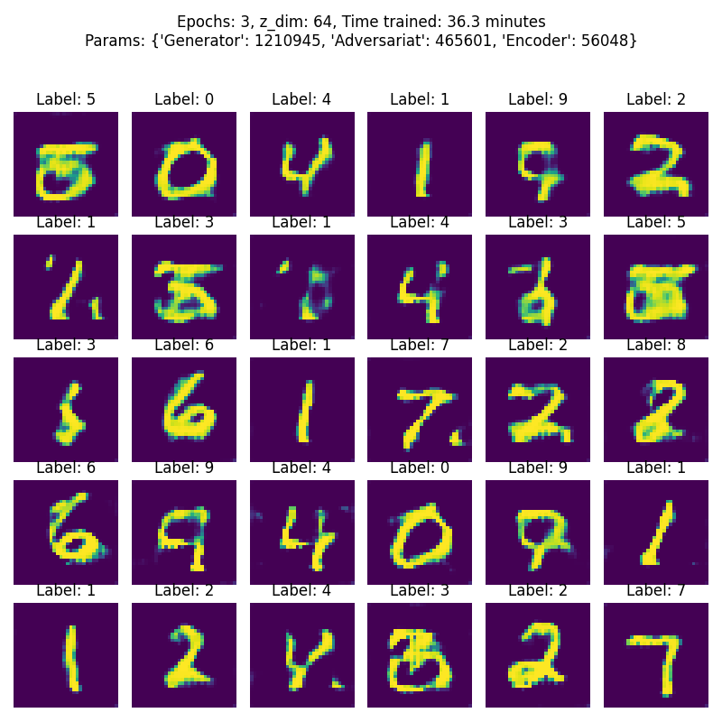
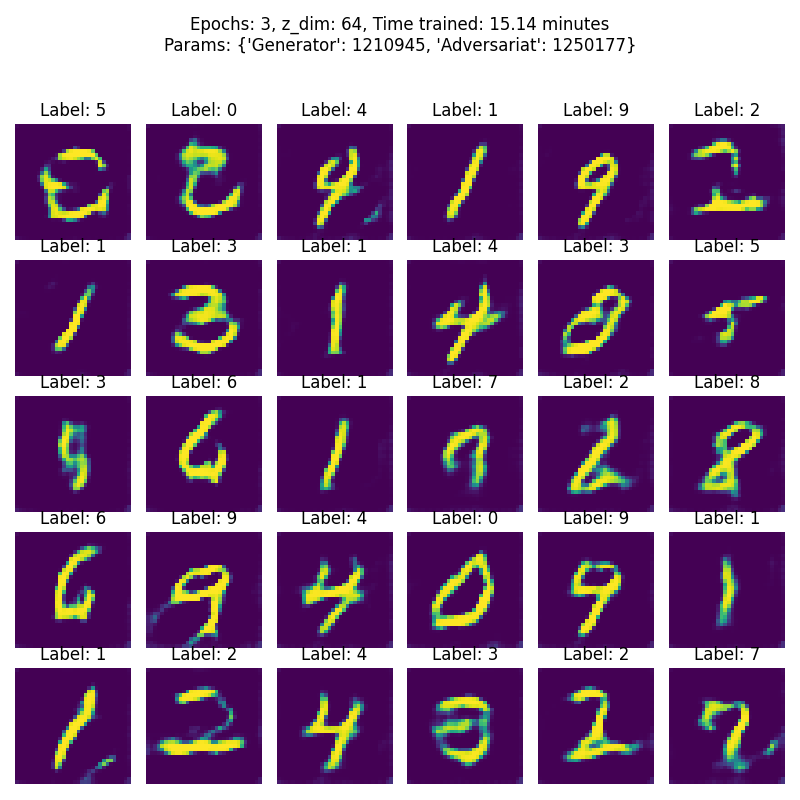
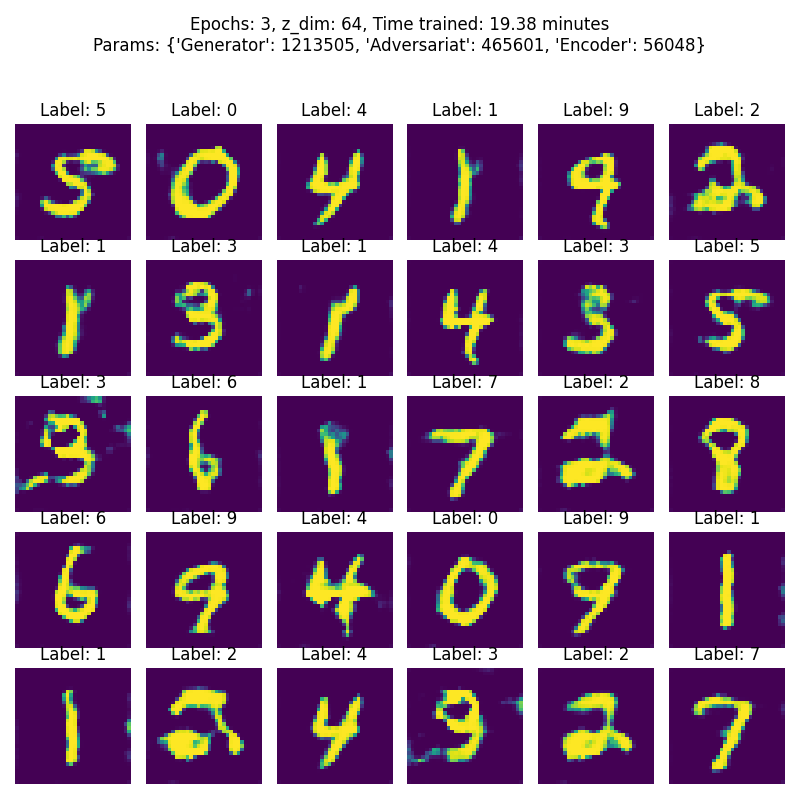
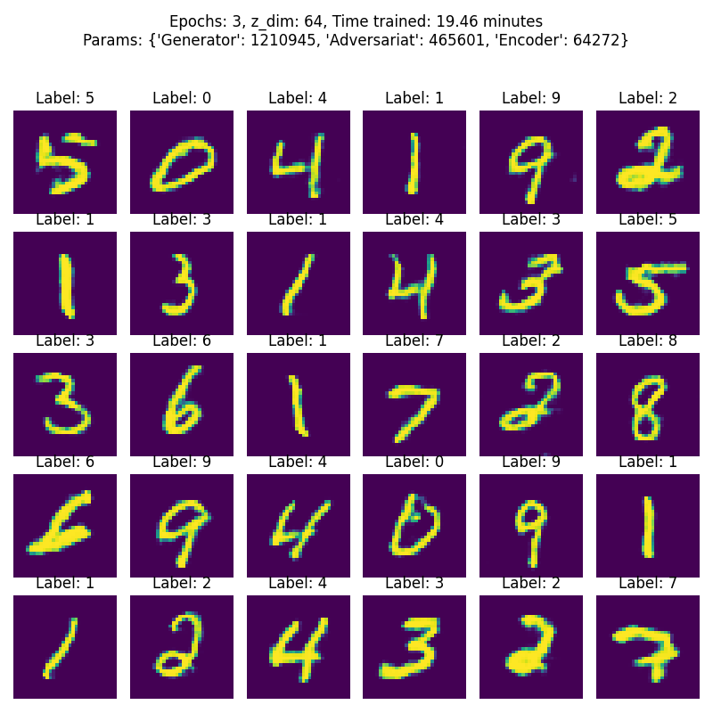
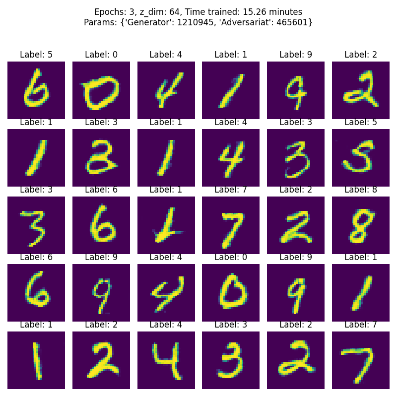
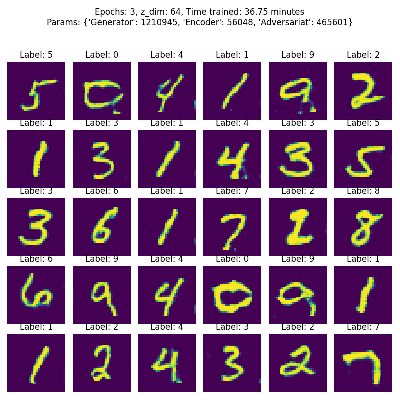
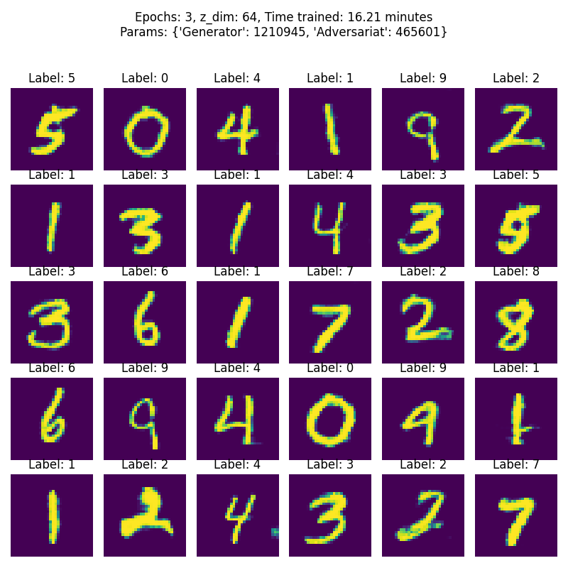
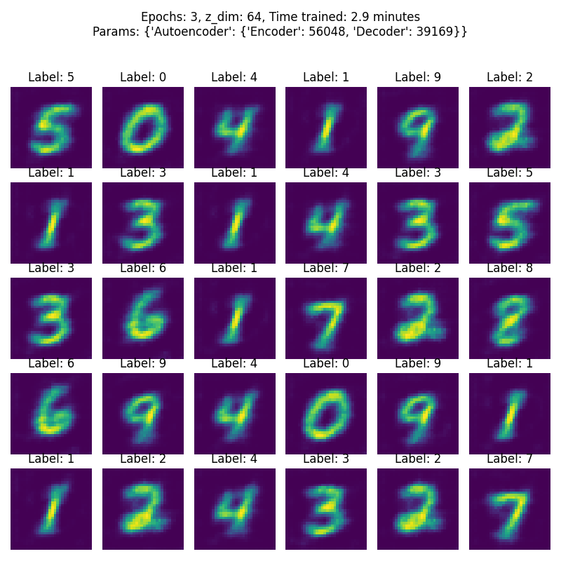

# vegans

A library to easily train various existing GANs (and other generative models) in PyTorch.

This library targets mainly GAN users, who want to use existing GAN training techniques with their own generators/discriminators.
However researchers may also find the GenerativeModel base class useful for quicker implementation of new GAN training techniquess.

The focus is on simplicity and providing reasonable defaults.

## How to install
You need python 3.6 or above. Then:
`pip install vegans`

## How to use
The basic idea is that the user provides discriminator / critic and generator networks (additionally an encoder if needed), and the library takes care of training them in a selected GAN setting. To get familiar with the library:

- Read through this README.md file
- Check out the notebooks (00 to 04)
- If you want to create your own GAN algorithms, check out the notebooks 05 to 07
- Look at the example code

vegans implements two types of generative models: Unsupervised and Supervised (examples given below). **Unsupervised algorithms** are used when no labels exist for the data you want to generate, for example in cases where it is too tedious or infeasible to generate labels for every output. The disadvantage is that after training the generation process will be unsupervised as well, meaning you have (in most cases) little control over which type of output is generated. **Supervised algorithms** on the other hand require you to specify the input dimension of the label (`y_dim`) and provide labels during training. All algorithms requiring labels are implemented as "ConditionalGAN" (e.g. `VanillaGAN` does not take labels, whereas `ConditionalVanillaGAN` does). These algorithms enable you to generate a specific output **conditonal** on a certain input.

In the case of handwritten digit generation (`MNIST`) a supervised algorithm let's you produce images of a certain number that you control (e.g. images of zeros). Supervised methods are also required for text-to-image, image-to-text, image-to-image, text-to-audio, etc. translation tasks, because output should be generated conditional on an input (what does the image look like _given_ a specific text snippet). Currently, the encoding of the conditional vector (label, text, audio, ...) has to be handled on the user side.

An interesting middle ground is take by the `InfoGAN` algorithm which tries to learn the labels itself during training. We refer to the original [paper](https://dl.acm.org/doi/10.5555/3157096.3157340) for more detailed information on the algorithm, but the vegans API for this method works similar to any other GAN. A conditional version exists, called `ConditionalInfoGAN` where label information can be provided but additional features are learned during training.

You can currently use the following generative models:

* `AAE`: [Adversarial Auto-Encoder](https://arxiv.org/pdf/1511.05644.pdf)
* `BicycleGAN`: [BicycleGAN](https://arxiv.org/pdf/1711.11586.pdf)
* `EBGAN`: [Energy-Based GAN](https://arxiv.org/pdf/1609.03126.pdf)
* `InfoGAN`: [Information-Based GAN](https://dl.acm.org/doi/10.5555/3157096.3157340)
* `KLGAN`: [Kullback-Leib GAN](https://www.inference.vc/an-alternative-update-rule-for-generative-adversarial-networks/)
* `LRGAN`: [Latent-Regressor GAN](https://arxiv.org/pdf/1711.11586.pdf)
* `LSGAN`: [Least-Squares GAN](https://openaccess.thecvf.com/content_ICCV_2017/papers/Mao_Least_Squares_Generative_ICCV_2017_paper.pdf)
* `VAEGAN`: [Variational Auto-Encoder GAN](https://arxiv.org/pdf/1512.09300.pdf)
* `VanillaGAN`: [Classic minimax GAN](https://papers.nips.cc/paper/5423-generative-adversarial-nets.pdf), in its non-saturated version
* `VanillaVAE`: [Variational Auto-Encoder](https://arxiv.org/pdf/1512.09300.pdf)
* `WassersteinGAN`: [Wasserstein GAN](https://arxiv.org/abs/1701.07875)
* `WassersteinGANGP`: [Wasserstein GAN with gradient penalty](https://arxiv.org/abs/1704.00028)


All current generative model implementations come with a conditional variant to allow for the usage of training labels to produce specific outputs:

- `ConditionalAEE`
- `ConditionalBicycleGAN`
- `ConditionalEBGAN`
- ...
- `ConditionalCycleGAN`
- `ConditionalPix2Pix`

This can either be used to pass a one hot encoded vector to predict a specific label (generate a certain number in case of mnist: [example_conditional.py](https://github.com/tneuer/GAN-pytorch/blob/main/examples/example_conditional.py)  or [03_mnist-conditional.ipynb](https://github.com/tneuer/GAN-pytorch/blob/main/notebooks/03_mnist-conditional.ipynb)) or it can also be a full image (when for example trying to rotate an image: [example_image_to_image.py](https://github.com/tneuer/GAN-pytorch/blob/main/examples/example_image_to_image.py)  or [04_mnist-image-to-image.ipynb](https://github.com/tneuer/GAN-pytorch/blob/main/notebooks/04_mnist-image-to-image.ipynb)).

Models can either be passed as `torch.nn.Sequential` objects or by defining custom architectures, see [example_input_formats.py](https://github.com/tneuer/GAN-pytorch/blob/main/examples/example_input_formats.py).

Also look at the [jupyter notebooks](https://github.com/tneuer/GAN-pytorch/tree/main/notebooks) for better visualized examples and how to use the library.

#### Unsupervised Learning Example

```python
from vegans.GAN import VanillaGAN
import vegans.utils.utils as utils
import vegans.utils.loading as loading

# Data preparation
datapath =  "./data/" # https://github.com/tneuer/vegans/tree/version/overhaul/data/mnist
X_train, y_train, X_test, y_test = loading.load_data(datapath, which="mnist", download=True)
X_train = X_train.reshape((-1, 1, 32, 32)) # required shape
X_test = X_test.reshape((-1, 1, 32, 32))
x_dim = X_train.shape[1:] # [height, width, nr_channels]
z_dim = 64

# Define your own architectures here. You can use a Sequential model or an object
# inheriting from torch.nn.Module. Here, a default model for mnist is loaded.
generator = loading.load_generator(x_dim=x_dim, z_dim=z_dim, which="example")
discriminator = loading.load_adversary(x_dim=x_dim, z_dim=z_dim, adv_type="Discriminator", which="example")

gan = VanillaGAN(
    generator=generator, adversary=discriminator,
    z_dim=z_dim, x_dim=x_dim, folder=None
)
gan.summary() # optional, shows architecture

# Training
gan.fit(X_train, enable_tensorboard=False)

# Vizualise results
images, losses = gan.get_training_results()
images = images.reshape(-1, *images.shape[2:]) # remove nr_channels for plotting
utils.plot_images(images)
utils.plot_losses(losses)

# Sample new images, you can also pass a specific noise vector
samples = gan.generate(n=36)
samples = samples.reshape(-1, *samples.shape[2:]) # remove nr_channels for plotting
utils.plot_images(samples)
```

#### Supervised / Conditional Learning Example

```python
import torch
import numpy as np
import vegans.utils.utils as utils
import vegans.utils.loading as loading
from vegans.GAN import ConditionalVanillaGAN

# Data preparation
datapath =  "./data/" # https://github.com/tneuer/vegans/tree/version/overhaul/data/mnist
X_train, y_train, X_test, y_test = loading.load_data(datapath, which="mnist", download=True)
X_train = X_train.reshape((-1, 1, 32, 32)) # required shape
X_test = X_test.reshape((-1, 1, 32, 32))
nb_classes = len(set(y_train))
y_train = np.eye(nb_classes)[y_train.reshape(-1)]
y_test = np.eye(nb_classes)[y_test.reshape(-1)]

x_dim = X_train.shape[1:] # [nr_channels, height, width]
y_dim = y_train.shape[1:]
z_dim = 64

# Define your own architectures here. You can use a Sequential model or an object
# inheriting from torch.nn.Module. Here, a default model for mnist is loaded.
generator = loading.load_generator(x_dim=x_dim, z_dim=z_dim, y_dim=y_dim, which="mnist")
discriminator = loading.load_adversary(x_dim=x_dim, z_dim=z_dim, y_dim=y_dim, adv_type="Discriminator", which="mnist")

gan = ConditionalVanillaGAN(
    generator=generator, adversary=discriminator,
    z_dim=z_dim, x_dim=x_dim, y_dim=y_dim,
    folder=None, # optional
    optim={"Generator": torch.optim.RMSprop, "Adversary": torch.optim.Adam}, # optional
    optim_kwargs={"Generator": {"lr": 0.0001}, "Adversary": {"lr": 0.0001}}, # optional
    fixed_noise_size=32, # optional
    device=None, # optional
    ngpu=0 # optional

)
gan.summary() # optional, shows architecture

# Training
gan.fit(
    X_train, y_train, X_test, y_test,
    epochs=5, # optional
    batch_size=32, # optional
    steps={"Generator": 1, "Adversary": 2}, # optional, train generator once and discriminator twice on every mini-batch
    print_every="0.1e", # optional, prints progress 10 times per epoch
    					# (might also be integer input indicating number of mini-batches)
    save_model_every=None, # optional
    save_images_every=None, # optional
    save_losses_every="0.1e", # optional, save losses 10 times per epoch in internal losses dictionary used to generate
    						  # plots during and after training
    enable_tensorboard=False # optional, if true all progress is additionally saved in tensorboard subdirectory
)

# Vizualise results
images, losses = gan.get_training_results()
images = images.reshape(-1, *images.shape[2:]) # remove nr_channels for plotting
utils.plot_images(images, labels=np.argmax(gan.fixed_labels.cpu().numpy(), axis=1))
utils.plot_losses(losses)

# Generate specific label, for example "2"
label = np.array([[0, 0, 1, 0, 0, 0, 0, 0, 0,0 ]])
image = gan(y=label)
utils.plot_images(image, labels=["2"])
```

### Slightly More Details:

#### Constructor arguments

All of the generative model objects inherit from a `AbstractGenerativeModel` base class. and allow for the following input in the constructor.

* `optim`: The optimizer to use for all networks during training. If `None` a default optimizer (probably either `torch.optim.Adam` or `torch.optim.RMSprop`) is chosen by the specific model. A `dict` type with appropriate keys can be passed to specify different optimizers for different networks.
* `optim_kwargs`:  The optimizer keyword arguments. A `dict` type with appropriate keys can be passed to specify different optimizer keyword arguments for different networks.
* `feature_layer`: If not None, it should be a layer of the discriminator of critic. The output of this layer is used to compute the mean squared error between the real and fake samples, i.e. it uses the feature loss. The existing GAN loss (often Binary cross-entropy) is overwritten.
* `fixed_noise_size`: The number of samples to save (from fixed noise vectors). These are saved within Tensorboard (if `enable_tensorboard=True` during fitting) and in the `Model/images` subfolder.
* `device`: "cuda" (GPU) or "cpu" depending on the available resources.
* `ngpu`: Number of gpus used during training
* `folder`: Folder which will contain all results of the network (architecture, model.torch, images, loss plots, etc.). An existing folder will never be deleted or overwritten. If the folder already exists a new folder will be created with the given name + current time stamp.
* `secure`: By default, vegans performs plenty of checks on inputs and outputs for all networks (For example `encoder.output_size==z_dim`, `generator.output_size==x_dim`  or `Discriminator.last_layer==torch.nn.Sigmoid`). For some use cases these checks might be too restrictive. If `secure=False` vegans will perform only the most basic checks to run. Of course, if there are shape mismatches torch itself will still complain.

#### fit() arguments

The fit function takes the following optional arguments:

- `epochs`: Number of epochs to train the algorithm. Default: 5
- `batch_size`: Size of one batch. Should not be too large: Default: 32
- `steps`: How often one network should be trained against another. Must be `dict` type with appropriate names. E.g., for the `WassersteinGAN` the dictionary could be `{"Generator": 1, "Adversary": 5}`, indicating that the adversary should be trained five times on every mini-batch while the generator is trained once. The keys of the dictionary are **fixed** by the specified algorithm (here ["Generator", "Adversary"], for BicycleGAN would be ["Generator", "Adversary", "Encoder"] ). An appropriate error is raised if wrong keys are passed. The possible names should be obvious from the constructor of every algorithm but a wrong dictionary, e.g. {"Genrtr": 1}, can be passed consciously to receive a list of correct and available key values.
- `print_every`: Determines after how many batches a message should be printed to the console informing about the current state of training. String indicating fraction or multiples of epoch can be given. I.e. "0.25e" = four times per epoch, "2e" after two epochs. Default: 100
- `save_model_every`: Determines after how many batches the model should be saved. String indicating fraction or multiples of epoch can be given. I.e. "0.25e" = four times per epoch, "2e" after two epochs. Models will be saved in subdirectory `folder`+"/models" (`folder` specified in the constructor, see above in **Constructor arguments**). Default: None
- `save_images_every`: Determines after how many batches sample images and loss curves should be saved. String indicating fraction or multiples of epoch can be given. I.e. "0.25e" = four times per epoch, "2e" after two epochs. Images will be saved in subdirectory `folder`+"/images" (`folder` specified in the constructor, see above in **Constructor arguments**).  Default: None
- `save_losses_every`: Determines after how many batches the losses should be calculated and saved. Figure is shown after `save_images_every` . String indicating fraction or multiples of epoch can be given. I.e. "0.25e" = four times per epoch, "2e" after two epochs. Default: "1e"
- `enable_tensorboard`: Determines after how many batches a message should be printed to the console informing about the current state of training. Tensorboard information will be saved in subdirectory `folder`+"/tensorboard" (`folder` specified in the constructor, see above in **Constructor arguments**).  Default: True

All of the generative model objects inherit from a `AbstractGenerativeModel` base class. When building any such GAN, you must pass generator / decoder as well as discriminator / encoder networks (some `torch.nn.Module`), as well as a the dimensions of the latent space `z_dim` and input dimension of the images `x_dim`.


#### Generative Model methods:

- `generate(z=None, n=None)`: Generate samples from noise vector or generate "n" samples.

- `get_hyperparameters()`: Get dictionary containing important hyperparameters.

- `get_losses(by_epoch=False, agg=None)`: Return a dictionary of logged losses. Number of elements determined by the `save_losses_every` parameter passed to the `fit` method.

- `get_number_params()`: Get the number of parameters per network.

- `get_training_results(by_epoch=False, agg=None)`: Returns the samples generated from the `fixed_noise` attribute and the logged losses.

- `load(path)`: Load a trained model.

- `predict(x)`: Use the adversary to predict the realness of an image.

- `sample(n)`: Sample a noise vector of size n.

- `save(name=None)`: Save the model.

- `summary(save=False)`: Print a summary of the model containing the number of parameters and general structure.

- `to(device)`: Map all networks to a common device. Should be done before training.


#### Generative model attributes:

- `feature_layer`: Function to calculate feature loss with. If None no feature loss is computed. If not None the feature loss overwrites the "normal" generator loss.
- `fixed_noise`, (`fixed_noise_labels`): Noise vector sampled before training and used to generate the images in the created subdirectory (if `save_images_every` in the `fit` mehtod is not None). Also used to produce the results from `get_training_results()`.
- `folder`: Folder where all information belonging to GAN is stored. This includes
  - Models in the `folder/models` subdirectory if `save_model_every` is not None in  the`fit()` method.
  - Images in the `folder/images` subdirectory if `save_images_every` is not None in the `fit()` method.
  - Tensorboard data in the `folder/tensorboard` subdirectory if `enable_tensorboard` is True in the `fit()` method.
  - Loss in the `folder/losses.png` if `save_losses_every` is not None in `fit()` method.
  - Loss in the `folder/summary.txt` if `summary(save=True)`called.
- `images_produced`: Flag (True / False) if images are the target of the generator.
- `total_training_time`, `batch_training_times`: Time needed for training.
- `x_dim`, `z_dim`, (`y_dim`): Input dimensions.
- `training`: Flag (True / False) if model is in training or evaluation mode. Normally the flag is False and is automatically set to True in the main training loop.

Attentive readers might notice that in most places we try to talk about "Generative Models" instead of "Generative Adversarial Networks", because `vegans` currently also supports the Variational Autoencoder algorithm (`VanillaVAE`) which are their own method of generating data. However, you can interpret the decoder of the VAE equivalently to a generator of a GAN. Both take the latent space (and sometimes labels) as input and transform them to the desired output space. In an abstract sense the encoder of the VAE also corresponds to the discriminator of the GAN as both aim to condense their input from the image space to a lower dimensional latent dimension. These abstract commonalities are used in the `AbstractGenerativeModel` to unify both types of algorithms and provide a largely similar API.

In the future we also plan to implement different VAE algorithms to have all generative models in one place but for now the library is focused on GAN algorithms.

If you are researching new generative model training algorithms, you may find it useful to inherit from the `AbstractGenerativeModel` or  `AbstractConditionalGenerativeModel` base class.

### Learn more:

Currently the best way to learn more about how to use vegans is to have a look at the example [notebooks](https://github.com/tneuer/GAN-pytorch/tree/main/notebooks).
You can start with this [simple example](https://github.com/tneuer/GAN-pytorch/blob/main/notebooks/00_univariate_gaussian.ipynb) showing how to sample from a univariate Gaussian using a GAN.
Alternatively, can run example [scripts](https://github.com/tneuer/GAN-pytorch/tree/main/examples).

## Contribute
PRs and suggestions are welcome. Look [here](https://github.com/unit8co/vegans/blob/master/CONTRIBUTING) for more details on the setup.

## Credits
Some of the code has been inspired by some existing GAN implementations:
* https://github.com/eriklindernoren/PyTorch-GAN
* https://github.com/martinarjovsky/WassersteinGAN
* https://pytorch.org/tutorials/beginner/dcgan_faces_tutorial.html


### Some Results

All this results should be taken with a grain of salt. They were not extensively fine tuned in any way, so better results for individual networks are possible for sure. More time training as well as more regularization could most certainly improve results. All of these results were generated by running the example_conditional.py program in the examples folder. Especially the Variational Autoencoder would perform better if we increased it's number of parameters to a comparable level.

| Network                |                         MNIST Result                         |
| :--------------------- | :----------------------------------------------------------: |
| Cond. BicycleGAN       |  |
| Cond. EBGAN            |  |
| Cond. InfoGAN          |  |
| Cond. KLGAN            |  |
| Cond. LRGAN            |  |
| Cond. Pix2Pix          |  |
| Cond. VAEGAN           |  |
| Cond. VanillaGAN       |  |
| Cond. WassersteinGAN   |  |
| Cond. WassersteinGANGP |  |
| Cond. VAE              |  |


## TODO

- GAN Implementations (sorted by priority)
  - BEGAN
  - WassersteinGAN SpectralNorm
  - Stacked GAN [here](https://arxiv.org/abs/1612.03242)
  - Progressive Growing GAN [here](https://arxiv.org/abs/1710.10196)
- Layers
  - Minibatch discrimination
  - Instance normalization
- Other

  - Update Notebooks

  - Update requirements and setup
  - architectures CIFAR and CelebA
  - Bug while saving
  - Document all networks
  - Test all examples

  - Core Improvements:

    - Pass neural_nets instead of generator / encoder, ...
    - Hide feature_layer, secure in **kwargs
    - Generalize conditional networks and only let them handle correct concatenation
    - Separate VAE and GAN implementations
- Abstraction for GED networks
  - New links to correct github files
  - Make it more PEP conform
  - Interpolation
  - Perceptual Loss [here](https://arxiv.org/pdf/1603.08155.pdf)


- Done
  - ~~No side effects for functions (self.\_losses, self.loss\_functions, self.\_optimizers, self.\_steps)~~
  - ~~Replace "Adversary"~~
  - ~~Residual Block~~
  - ~~Inception Block~~
  - ~~InfoGAN~~
  - ~~WassersteinLoss as object~~
  - ~~Train on CIFAR10~~
  - ~~CycleGAN~~
  - ~~Turn off secure mode~~
  - ~~Describe custom parameters~~
  - ~~plot images for 3d channels if possible else make it work for only one channel~~
  - ~~DataLoader~~
  - ~~Download~~
    - ~~Mnist~~
    - ~~CelebA~~
    - ~~CIFAR~~
    - ~~Fashion-MNIST~~
  - ~~Update README file~~
  - ~~Include well defined loaders for~~
    - ~~Mnist~~
    - ~~Fashion-MNIST~~
  - ~~DataLoader from torchvision.datasets~~
  - ~~Architectures that at least work for mnist~~
    - I~~mages to compare algorithms~~
    - ~~Note number params / training time~~
  - ~~Get rid of last layer name "output" in class Adversary and Encoder~~
  - ~~Unify data loading~~
  - ~~Better GPU handling~~
  - ~~update notebooks~~
  - ~~Update **tests**~~
  - ~~Feature loss (using forward hooks described [here](https://discuss.pytorch.org/t/how-can-l-load-my-best-model-as-a-feature-extractor-evaluator/17254/6))~~
  - ~~enable Wasserstein loss for all architectures (when it makes sense)~~
  - ~~Better default folder (probably None or make current subfolder)~~
  - ~~Better number of default steps for critic~~
  - ~~Adversarial Autoencoder~~
  - ~~get_number_params()~~
  - ~~BicycleGAN~~
  - ~~Introduce latent_space_net and real_space_net to make VAE abstraction better~~
  - ~~VAEGAN~~
  - ~~VAE~~
  - ~~KLGAN~~
  - ~~EBGAN~~
  - ~~GIF the results~~
  - ~~Better use case in README file~~
  - ~~Import good architectures (probably with help of torch)~~
  - ~~Write tests~~
  - ~~Test dependencies~~
  - ~~LR-GAN~~
  - ~~Least Squares GAN~~
  - ~~Include sources in jupyter~~
  - ~~Make all examples work nicely~~
  - ~~Implement Pix2Pix architecture: https://blog.eduonix.com/artificial-intelligence/pix2pix-gan/~~
  - ~~Include images in jupyter~~
  - ~~Pix2Pix~~
  - ~~Check output dim (generator, encoder)~~
  - ~~Improve Doc for networks~~
  - ~~Rename AbstractGAN1v1 -> AbstractAbstractGAN1v1~~
  - ~~Rename AbstractConditionalGAN1v1 -> AbstractAbstractConditionalGAN1v1~~
  - ~~Rename AbstractGenerativeModel -> AbstractAbstractGenerativeModel~~
  - ~~Rename AbstractConditionalGenerativeModel -> AbstractAbstractConditionalGenerativeModel~~
  - ~~return numpy array instead o tensor for generate.~~
  - ~~Automatically use evaluation mode~~


